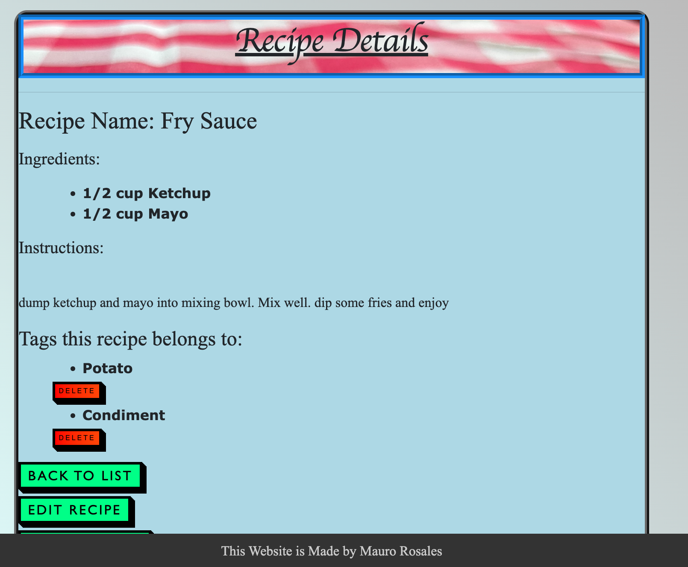

# Recipe Box app

#### By Mauro Rosales jr

#### enables user to create and store their recipes

## Technologies Used

* SQL
* MySQL
* VSCode
* C#
* HTML
* CSS
* Entity Framework
* LazyLoading
* MVC

## Description

Enables user to create a login, and input/view/edit/delete their recipes. Only the user can see thier own recipes, but all users are able to create and delete recipe tags. Tags enable the recipes to be categorized for easy searching. The recipe Creation Station will reformat the ingredients into an ingredient list, as long as the user is seperating the ingredients with a comma (,).

## Setup/Installation Requirements

* clone repo from https://github.com/maurorosalesjr/...
* create appsettings.json file to allow user to create a SQL database to this project
* add this code to the appsettings.json file and add the missing information { "ConnectionStrings": { "DefaultConnection": "Server=localhost;Port=[PORT];database=[DATABASE NAME];uid=[UID];pwd=[PASSWORD];" } }
* make sure appsettings.json file is on the .gitignore file
* in terminal type : dotnet restore
* in terminal type : dotnet build 
*  if no errors, in terminal type : dotnet ef migrations add Initial
* the previous step will build the database
* in terminal type : dotnet ef database update
* in terminal type : dotnet run
* copy/paste : http://localhost:5000 into browser window
* use links to create and build out database

## Sample

## Known Bugs

* CSS styling doesnt always load properly

## License

open source

for any questions or comments email me here: mauro.rosales247@gmail.com

Copyright (c) August 2022, Mauro Rosales Jr